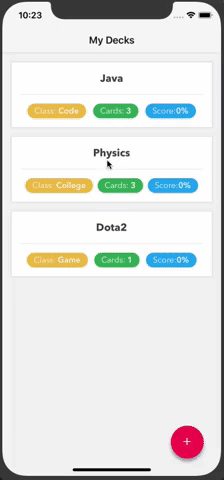
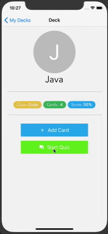

# FlashStash - React-Native/Redux App

A convenient reactive app to stash your flash cards for those "I'll get to it later" study sessions. 

This project was bootstrapped with [Create React Native App](https://github.com/react-community/create-react-native-app).

Below you'll find information about performing common tasks. The most recent version of the create-react-native-app guide is available [here](https://github.com/react-community/create-react-native-app/blob/master/react-native-scripts/template/README.md).

## Table of Contents
* [Demo](#demo)

* [Available Scripts](#available-scripts)
  * [npm start](#npm-start)
  * [npm run ios](#npm-run-ios)
  * [npm run android](#npm-run-android)


### Demo
  
  


## Available Scripts

### `npm start`

Runs your app in development mode.

Open it in the [Expo app](https://expo.io) on your phone to view it. It will reload if you save edits to your files, and you will see build errors and logs in the terminal.

Sometimes you may need to reset or clear the React Native packager's cache. To do so, you can pass the `--reset-cache` flag to the start script:

```
npm start --reset-cache
# or
yarn start --reset-cache
```

#### `npm run ios`

Like `npm start`, but also attempts to open your app in the iOS Simulator if you're on a Mac and have it installed.

#### `npm run android`

Like `npm start`, but also attempts to open your app on a connected Android device or emulator. Requires an installation of Android build tools (see [React Native docs](https://facebook.github.io/react-native/docs/getting-started.html) for detailed setup).
